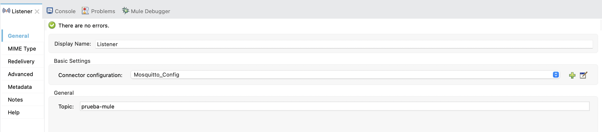

# Mule4-mosquitto-connector


This is a Mule Connector to Eclipse Mosquitto mqtt queue


Add this dependency to your application pom.xml

```
<dependency>
    <groupId>ar.kricom.muleConnector</groupId>
    <artifactId>mule4-mosquito-connector</artifactId>
    <version>1.0.4</version>
    <classifier>mule-plugin</classifier>
</dependency>
```

To install into your local .m2 repository:
```
mvn clean install
```
## How to use

Create a global configuration with Mqtt connection parameters


Publish operation:


Listener Sources:



### End
